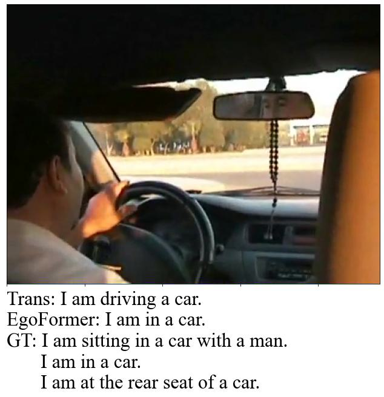
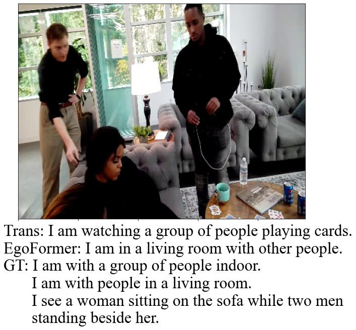

EgoCap and EgoFormer: First-Person Image Captioning
========

EgoCap is a first sizable dataset that supports end-to-end 1st-person narrative caption learning. It contain 2.1K egocentric images, over 10K captions, and 6.3K contextual
label. The EgoCap dataset can be downloaded from [here](https://drive.google.com/drive/folders/10u8kBlrqi9sFiXZrouP6FChypen4dcFz?usp=sharing).

EgoFormer is a two-stream transformer based network which accomplishes visual-context attention for ego-caption generation. Please cite this work as belew;

```
@inproceedings{egocap2022,
author = {Dai, Zhuangzhuang and Tran, Vu and Markham, Andrew and Trigoni, Niki and Rahman, M Arif and Wijayasingha, L. N. S. and Stankovic, John and Li, Chen},
year = {2022},
month = {},
pages = {},
booktitle={Proceedings of the British Machine Vision Conference (BMVC)},
publisher={BMVA Press},
title = {EgoCap and EgoFormer: First-Person Image Captioning with Context Fusion}
}
```

This repository implements the training and evaluation of EgoFormer. It is modified based on repository [CATR](https://github.com/saahiluppal/catr).

## Prerequisites ##

### Environment ###

*Python 3.7
*Pytorch 1.7
*torchvision 0.8.2
*transformers 4.12.5
*pycocoevalcap
*sklearn

### Usage ###

Specify source file links, training settings, and hyperparameters in *configuration.py*. Microsoft COCO 2017 dataset [http://cocodataset.org](http://cocodataset.org/#download) and EgoCap dataset are required. Use **Master** branch for vanilla transformer training, **coca_ctx_vit** for EgoFormer training, and the rest branches for comparative studies.

```python
python3 vit_pretrain  # Pre-train ViT context encoder, if needed
python3 main.py
```

## Evaluation ##

It is recommended to run the evaluation pipeline using [jupyter notebook](zdData.ipynb). Otherwise, use *predict.py* to generate caption of an image or use APIs in *Eval.py* to conduct quantitative analysis. Some qualitative results are shown below.

### EgoFormer v.s. Vanilla Transformer: ###

<p align="center">
  
  
</p>

## Acknowledge ##

Cyber Physical Systems, University of Oxford
